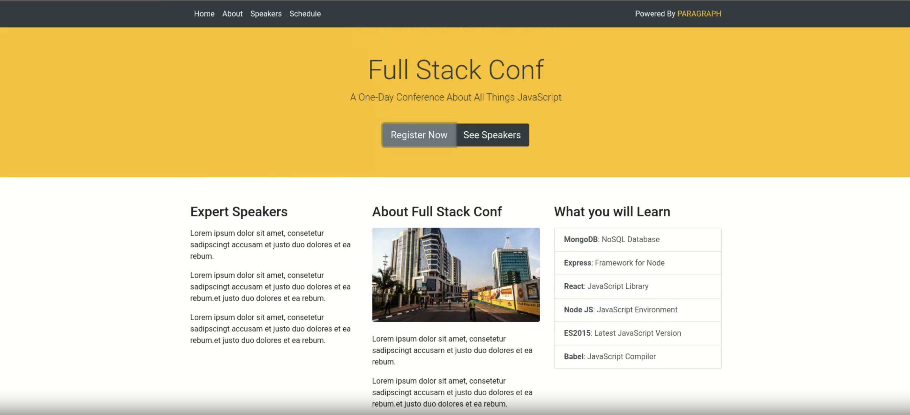
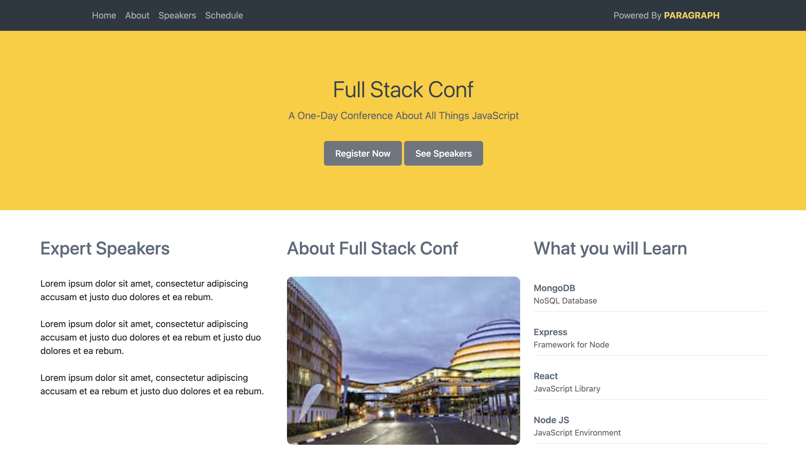
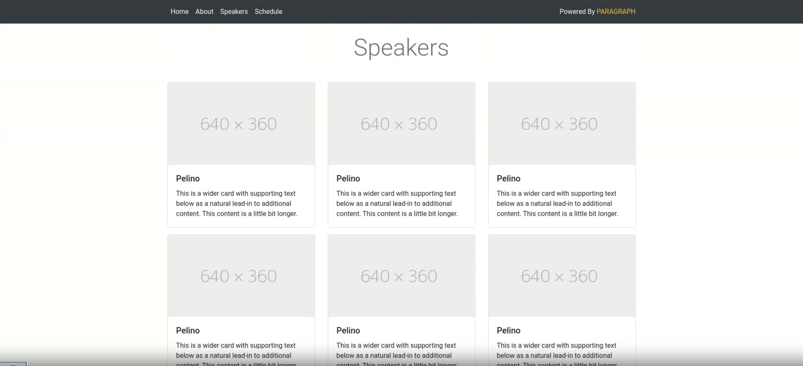
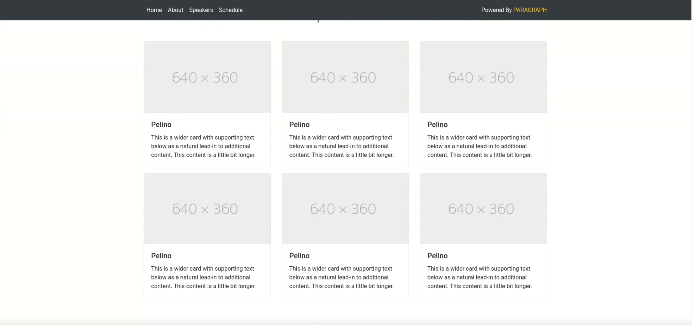
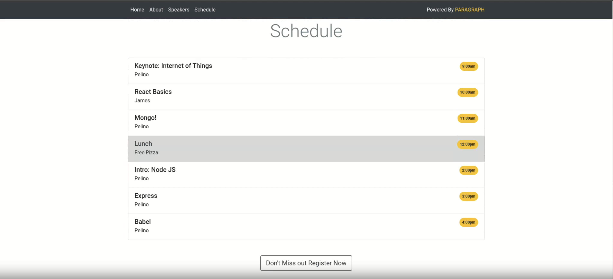
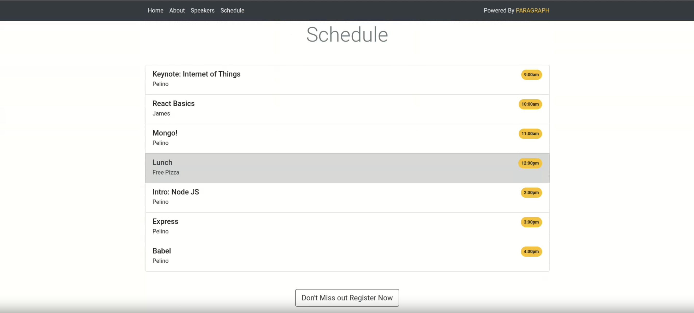
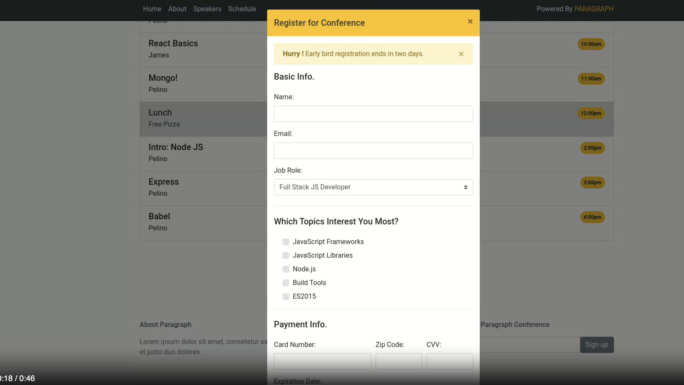
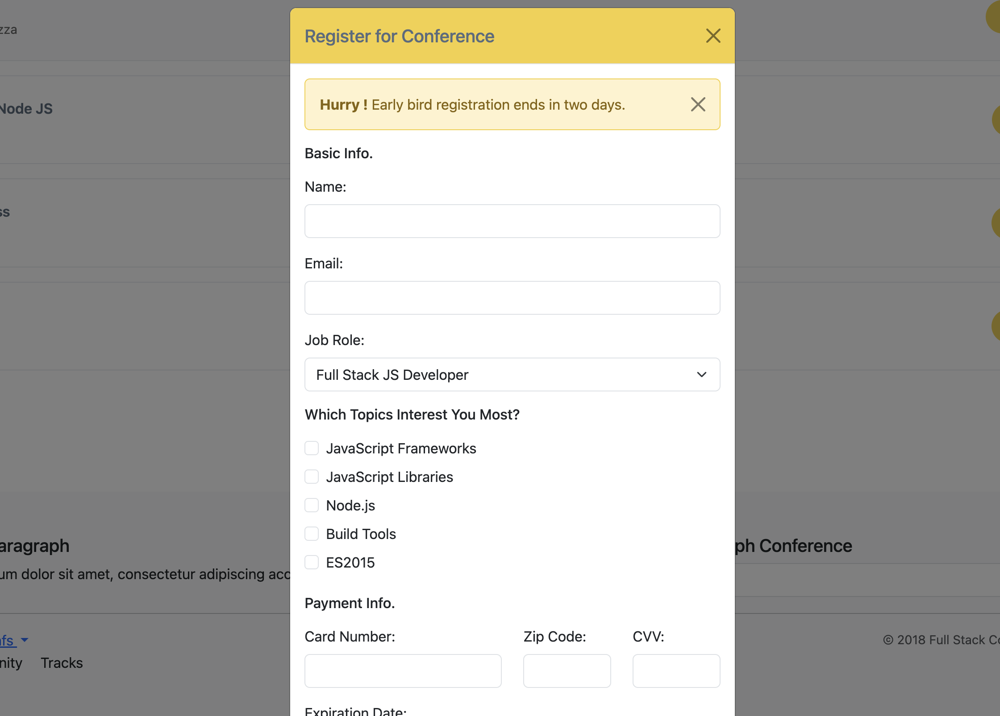
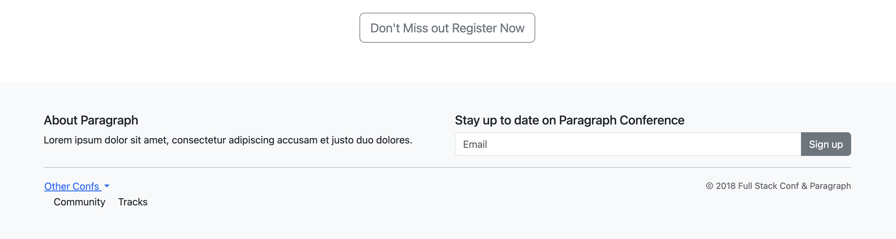

# 🎨 Full Stack Conference Website

A fully responsive single-page conference site built using **Bootstrap 5.3.2** with no custom JavaScript. This project recreates a demo design with smooth scrolling, speaker highlights, a detailed schedule, and a multi-step registration modal.

---

## 📁 Project Overview

This project aims to replicate the original conference demo as closely as possible. It uses semantic HTML, custom CSS, and Bootstrap components to deliver a clean, responsive design across devices.

**Technologies Used:**

- HTML5
- CSS3 (external file: `styles.css`)
- Bootstrap 5 (via CDN)

---

## ✅ Implemented Sections

- **Hero Section**: Golden gradient background, strong CTA, site overview
- **About Section**: Summary and speaker/tech highlights
- **Speakers Section**: Grid layout with six speaker cards
- **Schedule Section**: Time badges, session blocks, lunch highlight
- **Registration Modal**: Multi-step form with validation and styled alerts
- **Footer**: Includes a newsletter form and dropdown for "Other Conferences"

---

## 📸 Visual Comparison

**Our build vs the original design**
Here are screenshots showing how each section compares to the original mockup:

### 🏠 Hero Section Comparison

**Original Hero Section Design:**  


**Implemented Hero Section :**  


**Original Speakers Grid Design:**  


**Implemented Speakers Grid :**  


**Original Schedule Section Design:**  


**Implemented Schedule Section :**  


**Original Register Conference Design:**  


**Implemented Register Conference :**  


**Original Registration Modal Design:**  


**Implemented Registration Modal :**  


---

## 🌟 Features

### Core UI Features

- Anchor-based scrolling navigation
- Fully styled multi-step registration form with alerts
- Dropdown menu in footer
- Form validation and alert messages
- Newsletter signup form

### Design Details

- Golden yellow theme color: `#ffcc00`
- Bootstrap cards with hover effects for speaker profiles
- Responsive grid for layout consistency
- Gradient hero background with centered CTA
- Section spacing, typography hierarchy, and mobile optimizations

---

## 📱 Responsive Design

The layout adapts fluidly across devices:

- **Mobile (<576px)**: Stacked layout, single-column cards, small text
- **Tablet (576–992px)**: Two-column speaker grid, optimized images
- **Desktop (992px+)**: Three-column speaker layout, full-width content

---

## 👤 File Structure

```
/
├── index.html           # Main webpage file
├── styles.css           # Custom styles and responsive tweaks
├── screenshots/         # Screenshot comparisons of sections
└── README.md            # Project documentation (this file)
```

---

## 🚀 Getting Started

### Requirements

- A modern browser (Chrome, Safari, Edge)

### Run Locally

1. Clone the repository:

   ```bash
   git clone https://github.com/ALU-BSE/week-7-gloriaumutoni.git
   ```

2. Open the site:

   - Navigate to the folder
   - Open `index.html` in your browser

---

## 👥 Git Collaboration

This project was completed collaboratively. The Git history reflects clear task divisions and consistent contributions.

**Sample Contributions:**

- Implemented hero section and navbar
- Styled speaker grid and hover effects
- Created and tested registration modal
- Optimized layout for mobile devices

---

## 🛠 Bootstrap Components Used

- **Navbar**
- **Cards**
- **Modals**
- **Forms**
- **Alerts**
- **Grid System**
- **Dropdowns**
- **Buttons & Utilities**

---

## ♿ Accessibility

- Semantic HTML5 structure
- Labeled form fields
- Meaningful `alt` text on images
- Sufficient color contrast throughout
- Keyboard and screen reader friendly

---

## 🔧 Customization Guide

To update content:

- **Change theme colors** in `styles.css` (e.g., `.hero-section`, `.schedule-time`)
- **Update speaker info** inside the `.speakers` section in `index.html`
- **Edit the schedule** and session times under the `#schedule` section
- **Add or remove form fields** in the registration modal as needed

To add a new section:

```html
<section id="your-section" class="container my-5">
  <h2 class="text-center mb-4">Your Section Title</h2>
  <div class="row">
    <!-- Your content here -->
  </div>
</section>
```

---

## ✅ Testing & Verification

### Tested For:

- Navigation smoothness
- Modal functionality
- Input validation and alert messages
- Responsive layout across devices
- Image loading and visual balance

### Supported Browsers:

- Chrome (latest)
- Firefox (latest)
- Safari (latest)
- Edge (latest)

### Device Testing:

- Mobile (320px+)
- Tablets (portrait and landscape)
- Desktop (Full HD and above)

---
